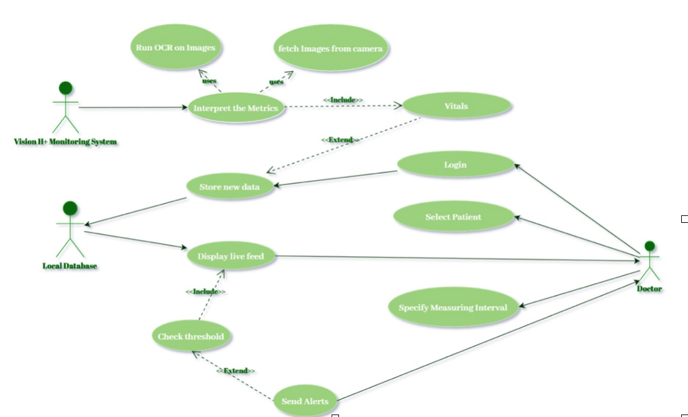
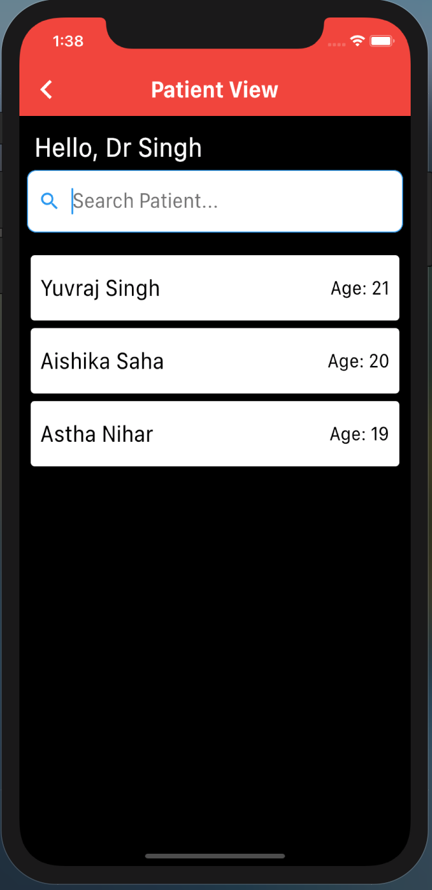
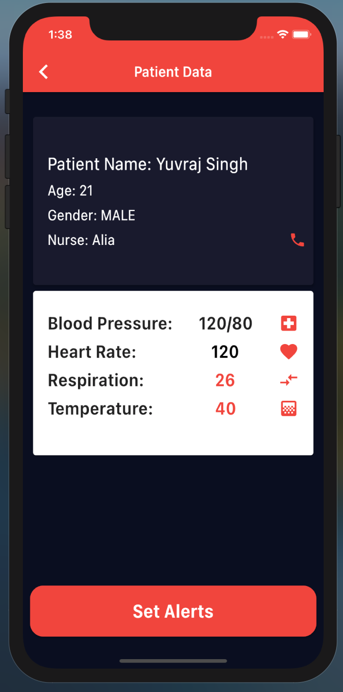

# Vision H+

 

## Introduction

Vision H+ is an ICU monitoring system which allows the doctor to monitor their patients anywhere, anytime saving them multiple trips (and a lot of time) to the ICU to check and ensure that the patient is doing well. The system consists of a Mobile application, through which the doctor can monitor the ICU System and set alerts if any of the health vitals go out of range. The second part of the system is an embedded device consisting of a camera, OCR, a local SQL database which processes the ICU monitor information, and sends the alerts and real time vital levels to the doctor’s application. 

 

## Application

 

## Technologies used:
1. Flutter
2. Nodejs
3. Expressjs
4. Google OAuth
5. Firestore
7. Google App Engine
8. Obviously, GitHub

 
